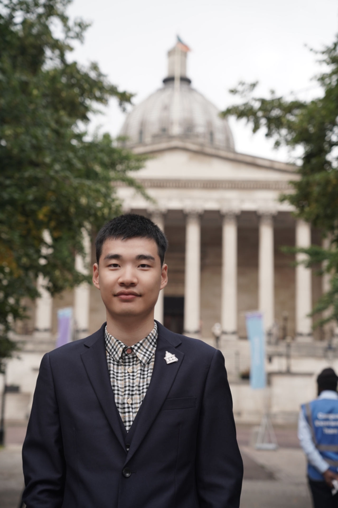
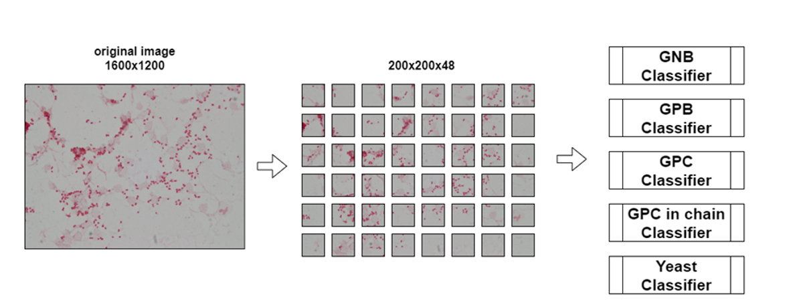

## Jingzhan Lu

A PhD student with a passion for Computational Genetics of Healthcare 🧬    

### Education
- University of Exeter (Medical School) &emsp;&emsp;&emsp;&emsp;&emsp;&emsp;&emsp;&emsp;&emsp;&emsp;&emsp; 10/2023 - Now  
  * PhD Genetics and Genomics
  * [Genetics of Complex Traits Research Group](https://www.exeter.ac.uk/research/diabetes-research/research/complextrait/)  

- University College London (UCL) &nbsp;&emsp;&emsp;&emsp;&emsp;&emsp;&emsp;&emsp;&emsp; &nbsp;  &nbsp;&emsp;&emsp;&emsp;&emsp;09/2021 - 12/2022  
  * MSc Health Data Science
  * [Human Genetics @UCL Lab](https://www.uclhumgen.com/)
- Taiwan Tzu Chi University（College of Medicine） &emsp;  &emsp;&emsp;&emsp;&emsp;09/2017 - 07/2021  
  * BEng Medical Informatics

### Research
- Predicting Prostate Cancer by combining prostate-specific antigen (PSA) test results with Genetic Risk Scores (GRS) 

- Impact of control selection strategies on GWAS results – a study of the Schizophrenia and Bipolar Disorder in the UK Biobank 
  [(Available on ResearchGate)](https://www.researchgate.net/publication/365265999_Impact_of_control_selection_on_genetic_case-control_studies-a_UK_Biobank_study_of_the_genetics_of_Schizophrenia_and_Bipolar_Disorder)
   
  &nbsp; &nbsp;&nbsp; &nbsp;&nbsp; &nbsp;&nbsp; &nbsp;&nbsp; &nbsp;&nbsp; &nbsp;&nbsp; &nbsp;&nbsp;&nbsp; &nbsp; &nbsp; &nbsp; &nbsp; &nbsp; &nbsp;&nbsp; &nbsp;&nbsp; &nbsp;&nbsp; &nbsp;&nbsp; &nbsp;&nbsp; &nbsp; &nbsp; &nbsp;&nbsp; &nbsp;&nbsp; &nbsp;&nbsp; &nbsp; Manhattan-Comparison Plot  
    
- To develop a platform for the identification of Gram-stained images using Deep Convolutional Neutral Network  
  
- Molecular docking analysis of Ritonavir, Lopinavir, Atazanavir, Darunavir and TMC-31091 as SARS-CoV-2 3CLpro inhibitors     
 &nbsp;&nbsp;&nbsp; &nbsp; &nbsp; &nbsp; &nbsp; &nbsp; &nbsp;&nbsp; 
### Social Media
I can be found on the following creative platforms：
- X：[Jingzhan Lu](https://twitter.com/JingzhanLu)
- ResearchGate：[Jingzhan Lu](https://www.researchgate.net/profile/Jingzhan-Lu)
- LinkedIn：[Jingzhan Lu](https://www.linkedin.com/in/jingzhan-lu-8b4065206/)
- Instagram：[lujingzhan](https://www.instagram.com/lujingzhan/)
### Conference and Talk
- ESHG 2024, European Human Genetics Conference 2024, Berlin, Germany
- SGGD 2024, Genetics of Diabetes, University of Exeter, UK
- 2022 AI-DLDA Summer School, University of Udine, Italy：[YouTube Video](https://www.youtube.com/watch?v=893cXc9hGP4&t=4s)
### Contact
- Email: 106316153@gms.tcu.edu.tw
